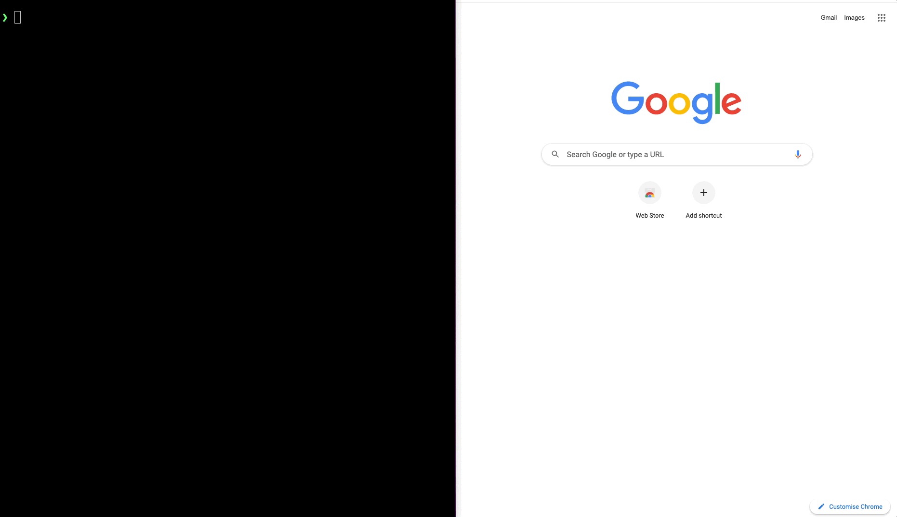

# AWS Google Give Me Credentials



## Use

* Configure AWS_LOGIN_URL, for example for Google:
  ```shell
  export AWS_LOGIN_URL=https://accounts.google.com/o/saml2/initsso?idpid=XXXX&spid=XXXX&forceauthn=false
  ```

* Start Google Chrome with remote debugging:
  ```shell
  # On Mac:
  killall 'Google Chrome'
  /Applications/Google\ Chrome.app/Contents/MacOS/Google\ Chrome --remote-debugging-port=9222 &
  ```

* Install required python packages:
  ```shell
  python3 -m pip install -r requirements.txt
  ```

* Execute **aws-google-gimme-creds** script:
  ```shell
  python3 aws-google-gimme-creds.py
  
  python3 aws-google-gimme-creds.py -a dev -r power
  ```

* Optional arguments:
  ```
  -h, --help            show this help message and exit
  -a ACCOUNT_MATCHER, --account ACCOUNT_MATCHER
                        Account name substring to match
  -r ROLE_MATCHER, --role ROLE_MATCHER
                        Role name substring to match
  -g REGION_MATCHER, --region REGION_MATCHER
                        Region name substring to match
  ```

## References
* [pychrome](https://github.com/fate0/pychrome)
* [Chrome DevTools Protocol](https://chromedevtools.github.io/devtools-protocol/tot/)

## ToDo
* Tests
* Error handling
* Compatibility with other systems (Windows, Linux)
* Chrome docker container
* Python package
